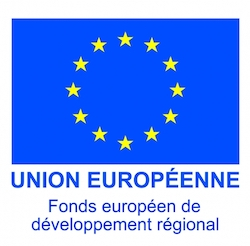

# EnerQuery Documentation

_EnerQuery_ is an energy-aware query optimizer framework. This framework leverages the PostgreSQL query optimizer by integrating energy dimension with many other features.

## Requirements

* Operating System: Ubuntu Version 14.04 LTS or higher, Windows 7 or higher
* Compiler: gcc version 4.8 or higher
* Library: Qt 5.5 or higher
* Watts Up? Pro power meter driver: _Optional_

## Download

All EnerQuery project files can be downloaded at https://github.com/lias-laboratory/enerquery/releases

* enerquery.tar.gz archive file contains:

  * postgresql-9.4.5: our modified version of the PostgreSQL DBMS with the energy dimension
  * enerquery: the GUI developed to interact the users with the system
* wattsup.tar.gz: contains the driver of Watts Up? PRO for both Linux and Windows
* enerquery-demo.mp4: Is a demonstration video of EnerQuery framework

## Build and Install

* To build and install PostgreSQL, please follow the official documentation: http://www.postgresql.org/docs/9.4/interactive/installation.html
* To build EnerQuery tool simply use Qt Creator IDE

## Publications

* Amine Roukh, Ladjel Bellatreche, Carlos Ordonez: _EnerQuery: Energy-Aware Query Processing_. CIKM 2016
* Amine Roukh, Ladjel Bellatreche, Nikos Tziritas, Carlos Ordonez: _Energy-Aware Query Processing on Parallel Database Cluster Nodes_. ICA3PP 2016
* Amine Roukh, Ladjel Bellatreche: _Eco-Processing of OLAP Complex Queries_. DaWaK 2015
* Amine Roukh, Ladjel Bellatreche, Ahcène Boukorca, Selma Bouarar: _Eco-DMW: Eco-Design Methodology for Data warehouses_. DOLAP 2015
* Amine Roukh: _Estimating Power Consumption of Batch Query Workloads_. MEDI 2015

## Software license agreement

* Details the license agreement of EnerQuery: [LICENSE](LICENSE)

## Historic Contributors

* Amine ROUKH (Université de Mostaganem)
* Simon Pierre DEMBELE (Ambassade de France au Mali)
* [Ladjel BELLATRECHE](https://www.lias-lab.fr/members/bellatreche/) (LIAS/ISAE-ENSMA)

## Acknowledgment

This work is carried out thanks to the support of the European Union through the PLAIBDE project of the FEDER-FSE operational program for the Nouvelle- Aquitaine region. The project is supported by aYaline company, with partners: LIAS-ENSMA laboratory in Poitiers, and the L3i laboratory at La Rochelle University.

## Reconnaissance

Ce travail est réalisé grâce au soutien de l'Union Européenne à travers le projet PLAIBDE du programme opérationnel FEDER-FSE pour la région Nouvelle-Aquitaine. Le projet est porté par l'entreprise aYaline, avec des partenaires: le laboratoire LIAS-ENSMA de Poitiers, et le laboratoire L3i de l'Université de La Rochelle.

